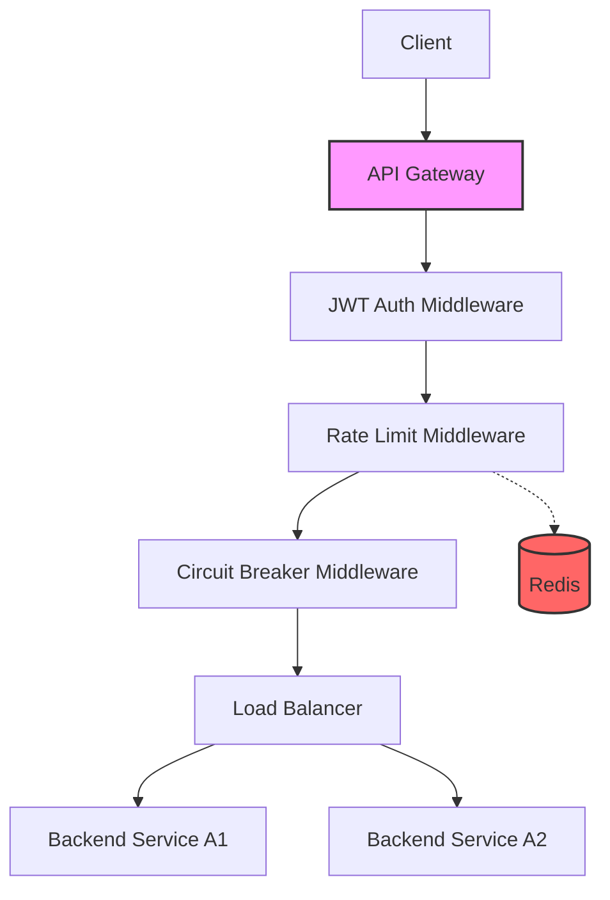

<p align="center">
  
</p>

<h1 align="center">Professional API Gateway</h1>

<p align="center"><strong>A high-performance, production-ready Reverse Proxy and Gateway built in Go</strong></p>

<p align="center">
  <a href="#quick-start">Quick Start</a> •
  <a href="#features">Features</a> •
  <a href="#architecture">Architecture</a> •
  <a href="#configuration">Configuration</a> •
  <a href="#benchmarks">Benchmarks</a> •
  <a href="#roadmap">Roadmap</a>
</p>

<p align="center">
  
  
  
  
</p>

---

Professional API Gateway is a **production-quality reverse proxy** and infrastructure component designed for high-performance microservices environments. It leverages Go's **native net/http stack** for speed and **Redis** for distributed state management — providing isolation, security, and resilience without heavy external dependencies.

**Built to demonstrate deep understanding of:**

*   **Systems Programming** — re-exec patterns, signal handling, and graceful shutdowns.
*   **Networking** — reverse proxying, load balancing algorithms, and header manipulation.
*   **Resilience Engineering** — circuit breakers, rate limiting, and timeout management.
*   **Infrastructure** — containerization, hot-reloading configurations, and structured telemetry.

---

## Architecture



---

## Features

### 🛡️ Security & Auth
- **JWT Validation**: Built-in middleware for stateless authentication.
- **Protocol Safety**: Secure header propagation and host header management.

### ⚡ Performance & Scalability
- **Round-Robin LB**: Thread-safe load balancing across multiple backend units.
- **Redis Rate Limiting**: Distributed rate limiting using fixed-window counters.
- **Hot-Reload**: Configuration updates via YAML without dropping connections.

### 🧩 Resilience
- **Circuit Breaker**: Automatic service protection with Closed/Open/Half-Open states.
- **Graceful Shutdown**: Handles OS signals to finish in-flight requests before exiting.

---

## Quick Start

### Prerequisites
- Go 1.23+
- Docker & Docker Compose
- Redis (for rate limiting)

### Run with Docker Compose
```bash
docker-compose up --build
```

### Build & Run Locally
```bash
make build
./bin/gateway
```

## Benchmarks

The gateway is built for speed. Run the internal benchmarks to verify throughput:

```bash
make bench
```

> [!TIP]
> On modern hardware, the Round Robin balancer handles over **5,000,000 ops/s** per core with zero allocations.

## Configuration

Custom routes and middleware are managed through `configs/config.yaml`:

```yaml
gateway:
  routes:
    - path: "/api/v1/service-a"
      targets: ["http://localhost:8081", "http://localhost:8083"]
      methods: ["GET", "POST"]
      middleware:
        - auth
        - ratelimit
```

---

## Roadmap
- [ ] Support for **gRPC** transparent proxying.
- [ ] **Canary Releases** and Weighted Round Robin.
- [ ] **Prometheus** metrics and Grafana dashboard.
- [ ] **Web Dashboard** for real-time traffic monitoring.

## License
MIT
